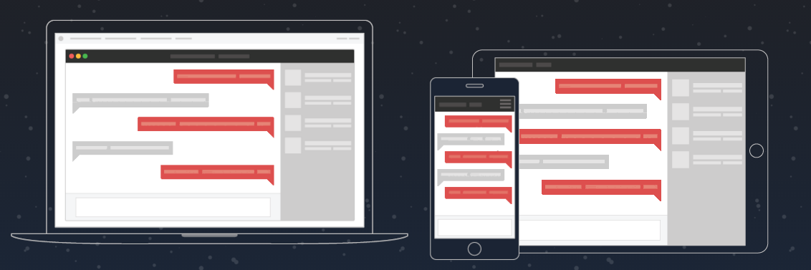

# Introduction to Meteor.JS

Slides and materials are hosted and available in this repo, for a 5-part, 2 session class on Meteor.js.

This curriculum is adapted from Robert Dickert's Meteor.JS Tutorials, graciously provided for our Girl Develop It community, taught by Aurelia Moser and  of the official Girl Develop It PHP/MySQL curriculum, developed by Sylvia Richardson for the Raleigh/Durham chapter.The course is meant to be taught in 4 two-hour sections. Each of the slides and practice files are customizable according to the needs of a given class or audience.

## Course description

[Meteor.js](https://www.meteor.com/) is a popular application platform, that allows you to quickly develop reactive apps for iOS, Android, and the web, entirely in Javascript on one open source code-base. Ever wanted to break into responsive, mobile development with only a background understanding of HTML/CSS and some scripting languages? Feel like you understand some of the fundamentals of web-programming but know next-to-nothing about mobile apps? Want to brush up on some Javascript from a previous course? If so, this course is for you!

We'll explore the core features of Meteor as we build a functional chat application with very little code (<100 lines of Javascript! Wowwee!). 

This two-part workshop will cover: 

* Meteor installation and creating your own app 
* Implementing a basic chat app 
* Adding user accounts 
* Refining the app UI 
* Deploying the app and creating a mobile version

### Prerequisites:

This course will presume some prior knowledge of HTML/CSS and some Javascript. A willingness to use the command line is necessary; we will be running some commands for installation, changing directories, and interacting with Meteor's CLI throughout the class. Do not be intimidated, the course will walk you through all steps and you will be provided with sample code to build our course app!

### Tech requirements:

 - Your laptop (with administrative privileges for installing software and a command line interface)
 - A modern web browser - either Chrome or Firefox with Firebug installed.
 - A text editor. We recommend Sublime Text 2 (free; available for Mac, PC, and Linux).
 - Your power supply
