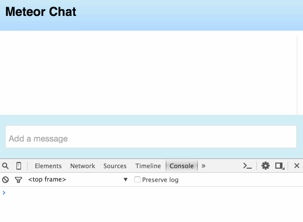
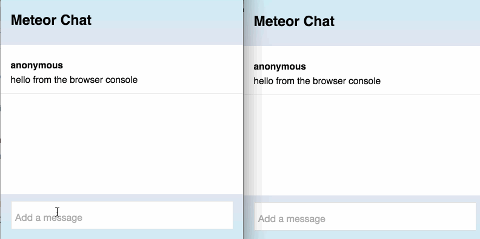
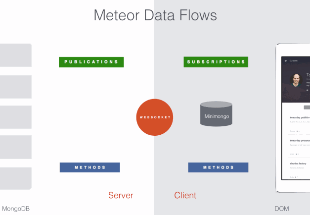

## Meet Meteor Part Two: Core chat functionality

## You are here.

This is part 2 of a 5 part series:

1. [Install Meteor and create your app](chat-tutorial-part-1.md)
2. Implement basic chat
3. [Add user accounts](chat-tutorial-part-3.md)
4. [Refine the UI of the app](chat-tutorial-part-4.md)
5. [Deploy the app and create a mobile version](chat-tutorial-part-5.md)

If you completed part 1, you have a scaffold ready to go. Let's fill that in and get messages moving between all connected clients.

## Render messages in HMTL

Let's tell the app how to render chat messages. We are using Meteor's Blaze view layer (you can use [Angular](https://www.meteor.com/tutorials/angular/creating-an-app), [React](https://facebook.github.io/react/), and other view layers if you prefer for future apps). 

Blaze uses [Handlebars](http://handlebarsjs.com/) syntax, which uses curly braces to add dynamic elements to our HTML. We will use the `#each` helper to render the `message` template one time for each message. In `chat.html`, replace `<!-- chat messages here -->` with: 

```html
    <ul class="message-window">
      {{#each recentMessages}}
        {{> message}}
      {{/each}}
    </ul>
```


Then add the `message` template at the bottom of the file:

```html
<template name="message">
  <li class="message">
    <div class="username">{{username}}</div>
    <div class="message-text">{{messageText}}</div>
  </li>
</template>
```


This template will be able to access the `username` and `text` attributes of the database document we use as its context.

## Add the database and client cache

Meteor comes with a full-stack reactive database driver. MongoDB is installed on the server, and Meteor provides an in-memory client data cache called [Minimongo](https://www.meteor.com/mini-databases) on the browser. [Minimongo](https://www.meteor.com/mini-databases) can be queried with the same API as MongoDB, allowing fast local access to a subset of the master database. Minimongo's data is kept in sync with the master database in real-time using [Meteor's Distributed Data Protocol (DDP)](https://www.meteor.com/ddp) over websockets. On the server, data changes are observed real-time using Meteor's [Livequery](https://www.meteor.com/livequery).


Setting all this up would be a huge undertaking if you did it yourself, but Meteor has it covered. Here is all the code you need to set it up. Put the following into chat.js (again `/* comments */` will show us where to add new code as we build up the functionality of the app).

```javascript
Messages = new Mongo.Collection("msgs");

Meteor.methods({
  sendMessage: function (messageText) {
    /* add authentication here */

    Messages.insert({
      messageText: messageText,
      createdAt: new Date(),
      username: "anonymous"
    });
  }
});

if (Meteor.isServer) {
  // This code only runs on the server
  Meteor.publish("messages", function () {
    return Messages.find({}, {sort: {createdAt: -1}, limit: 5});
  });
}

/* scrolling code */

if (Meteor.isClient) {
  // This code only runs on the client
  Meteor.subscribe("messages");

  /* helper code */

  /*chat window scrolling*/

  /*events*/

  /*account config*/
}
```

One thing you may notice about the code is that we are able to specify where code will run with `if (Meteor.isClient` and `if (Meteor.isServer)`[^client-server-folders]. That means the the first line, `Messages = new Mongo.Collection("msgs");` runs on both client and server. On the server, it creates a MongoDB collection called `Messages` (referenced as `msgs` internally by MongoDB), and on the client, it makes a similarly named collection with Minimongo. 


The way we will track messages is by storing them in the Messages collection. The next line creates a Meteor method called `sendMessage`. This also runs on both the client (storing the message locally) and the server (adding it to the master database). We use the MongoDB `insert` method to do this. We mark when the message was created with the current time (`new Date()`) and log the user as "anonymous" for now. Meteor will manage the network connection for us.


To synchronize the server's database with the client cache, we connect them with a publication. You can see this in starting in the `if (Meteor.isServer)` block. On the server, we create a publication called `"messages"`, and on the client, we subscribe to it. Meteor will synchronize these over websockets using DDP. The contents of the publication are set by a [standard MongoDB query](https://docs.mongodb.org/manual/tutorial/query-documents/) that returns the 5 most recent messages. (Choosing a small number is a "cheat" so we don't have to deal with message window scrolling yet.)

The publication is very much like setting up an [HTTP GET](http://www.w3schools.com/tags/ref_httpmethods.asp) endpoint, but there is a key difference. When data changes the results of a query, all subscribed clients will automatically get the updated results. We set up the endpoints with a simple [pub/sub](https://en.wikipedia.org/wiki/Publish%E2%80%93subscribe_pattern) relationship, and Meteor sets up the websocket and manages synchronization of the data using DDP. DDP provides a clear protocol and connection point, not just for the Meteor client, but also for any client that follows the protocol. DDP can therefore act as a **[REST](http://rest.elkstein.org/) for websockets**. There are DDP clients in Node, Python, and other languages, as well as native iOS and Android packages.


## Set up the the recentMessages helper

In our HTML, we told the template to iterate over an array of messages using `{{ #each recentMessages }}`. We still need to provide the array of messages from the database. Replace `/* helper code */` with the following inside the `if (Meteor.isClient)` block in the .js file:

```javascript
  Template.body.helpers({
    recentMessages: function () {
      return Messages.find({}, {sort: {createdAt: 1}});
    },
    /* unread message helper */
  });
```


* `Template.body.helpers` is what we use to define the helper functions on the main body of the app (you can replace `body` with a template name to set up helpers for other templates). 
* `recentMessages` is a function that just returns a MongoDB query result.[^cursor-vs-array] This time it's on the client, so this is on Minimongo, and it will be sorted in forward chronological order so that messages read from top to bottom. 

Notice how Minimongo allows us to continue working with the database with exactly the same API as on the server, allowing code to be shared or moved between client and server with no changes. When people talk about *[isomorphic JavaScript](http://isomorphic.net/)*, this is what they mean, but this is a level deeper, because it's the same API, not just the same language. 


In most frameworks, that database query would look different on the client (using Angular, Backbone, etc.) and the server (using native MongoDB or an ORM like Mongoose). 

## Post your first message


Believe it or not, our app is now able to render text messages. [Go into the browser console](http://webmasters.stackexchange.com/questions/8525/how-to-open-the-javascript-console-in-different-browsers) and call the `sendMessage` method with the following:

```
Meteor.call('sendMessage', 'hello from the browser console')
```



You will see your message rendered in the app. Go ahead and add another message or two if you like. 

We didn't write any code to update the browser, so how did this work? When we called the method, it ran on the browser first, doing an insert on Minimongo. The templates we set up to render the messages were automatically wired by Meteor to watch for changes to their data source (the `recentMessages` helper). When Minimongo updated itself, that changed the result of the `recentMessages` helper, which caused the template to re-render. 

This ability to rerender when data changes is called **[reactivity](https://en.wikipedia.org/wiki/Reactive_programming)**. Not only does this save you from writing a bunch of code, but it allows you to create your app more *declaratively* – that is, you write the HTML templates as if you were rendering the app the very first time, and Meteor will update it to reflect changes in the data. Meteor is actually very careful about what it updates, changing the minimum number of things necessary. 

Because it doesn't rerender the entire template, user input fields and DOM changes from things like jQuery plugins will not be overwritten, avoiding a common problem in reactive frameworks.

It is worth noting that **Meteor is watching the database**, not just responding to framework hooks. You can prove this by going into the MongoDB console. In the terminal from within your project (and with the server running), type `meteor mongo`. The meteor tool will put you into MongoDB's server console. You can now add another message with the following (remember, internally, MongoDB calls our collection `msgs`:

```
db.msgs.insert({text: 'hello from Mongo', createdAt: new Date, username: 'mongo console'})
```

You should see this appear immediately in your chat window. Meteor is able to watch Mongo by tailing its oplog, a change log that is used for replication within MongoDB clusters. 


This means that you can use the database for an integration point between a meteor app and and an existing app. If another app can write to MongoDB, Meteor can watch those changes and report the results in real-time.

## React to user Input

Let's make the app post messages typed into the UI. Our HTML `<input>` is inside a form, so we can respond to `submit` events. Meteor's [syntax for events](http://backbonejs.org/#Events) is similar to [Backbone](http://backbonejs.org/)'s. Replace `/*events*/` in the JavaScript file:

```
  Template.body.events({
    "submit .new-message": function (event) {
      var text = event.target.text.value;

      Meteor.call("sendMessage", text);

      event.target.text.value = "";
      event.preventDefault();
    },

    /* scroll event */

  });
```

When it receives a `submit` event on the input (`class="new-message"`), it will retrieve the text, send it with the `sendMessage` method just like we did from the browser console, and blank out the input, using `event.preventDefault()` to keep the page from refreshing. Go ahead and add a message in the app. Sure enough, you can now add messages. 


##Now for the cool part


Let's open a second browser and point it to [localhost:3000](http://localhost:3000/). Put it side-by-side with the first browser. Now type a message in one of the browsers. You'll see that it appears in other as well.



With Meteor, we got the "hard part" of the chat app for free! We didn't have to write any code to send chat messages down to the other client. Meteor handles that with Livequery and pub/sub.


##Meteor data flow 



Let's review how this app works. When you hit enter to send your message, Meteor does the insert locally on Minimongo, which reactively updates the DOM right away based on your templates. 

This is called "[optimistic UI](http://info.meteor.com/blog/optimistic-ui-with-meteor-latency-compensation)," because it is assuming that the change at the client will be accepted by the server. This makes the app feel very snappy and responsive because we don't have to wait for the server round-trip to display the result. At the same time, it sends the method to the server and runs an insert against the server database. The server database is the "single source of truth." In most cases, there will be no change.

 But in a chat app, it's possible that someone else will have sent a message just before ours, so the server will insert that above ours. The final version is then pushed down to the client via the subscription. Minimongo will discard its optimistic result and accept the server's result, updating the message window if necessary.

## Conclusion: A working (anonymous) chat app

We already have the working core of a chat app! 

Here's what we did:

* installed Meteor and created a project in a few minutes
* wrote declarative templates
* set up real-time database connectivity using pub/sub
* allowed database updates with Meteor methods
* responded to UI events

Also take note of what we didn't have to do:

* set up the server database
* create a client-side cache
* establish websockets
* write code to monitor the database
* write code to mutate the DOM

Not bad for a few lines of code! The main thing missing is that messages are anonymous, which severely limits our chat app's usefulness. We need people to be able to log in so we can keep track of who's who. We can also prevent anonymous messages altogether to show the basics of securing the app. 

We'll cover these in [part three of the tutorial](chat-tutorial-part-3.md).


[^client-server-folders]: You can specify that entire files only load on the client or server by placing them in folders called `client/` or`server/` in your project root.

[^cursor-vs-array]: Note that in this code we return a *cursor*, not an array. To get the array of documents, we could have called the `fetch()` method: `return Messages.find({}, {sort: {createdAt: 1}}).fetch();`. A [cursor](http://docs.meteor.com/#/full/mongo_cursor) is an object that defines a result set that can be accessed via `fetch`,  `map`, or `forEach` (or quantified with `count`). By handing Meteor the cursor instead of the final array, we allow Meteor to make fine-grained updates to our app. Meteor will automatically fetch/update data as needed.