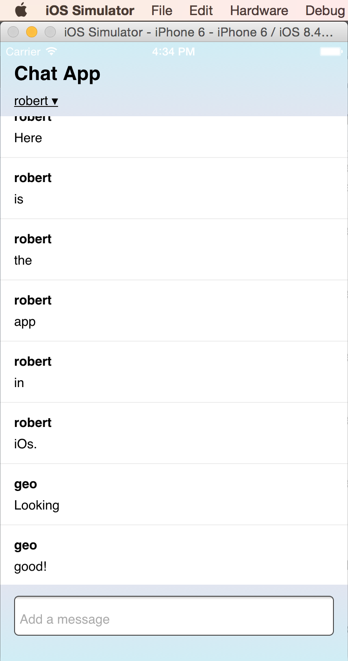

# Meet Meteor Part Five: Deploying and Building for Mobile
 
## You are here.

 This is the last of a 5 part series:

1. [Install Meteor and create your app](chat-tutorial-part-1.md)
2. [Implement basic chat](chat-tutorial-part-2.md)
3. [Add user accounts](chat-tutorial-part-3.md)
4. [Refine the UI of the app](chat-tutorial-part-4.md)
5. Deploy the app and create a mobile version

## Let's show the world: Deploying

We've made a chat application with user accounts, a scrollable window, and visible notification when new messages come while we are scrolling through the chat history. This app is ready to show to the world! In other frameworks, it would be time to figure out how to bundle up the app and get it on a server somewhere. We would also have to decide whether it was worth the expense and hassle to do this. With Meteor, it's free and dead-simple. From your `chat/` directory (and choosing a unique name instead of "app-name"):

```bash
meteor deploy app-name
# choose a unique name instead of 'app-name'
```

This will deploy your app to a server provided by Meteor at the address `app-name.meteor.com`. This is a free service with no time limit that Meteor provides to all of its users. This service works fine for small apps, and it includes  MongoDB. The Meteor tool will inform you of progress as the app is bundled and deployed, and it will inform you when your app is serving. Once it's finished, check out your chat app online. You can now share this with other people and chat from across the world!

## Deploying to other servers

If you outgrow the free server or need more control of your environment, you can deploy your app to your own server. You can deploy to any server that supports Node.js and Fibers.

```bash
meteor build meteor-chat
``` 

It will output a directory that contains a tarball of the needed files as well as instructions on how to deploy the app.

## Mobile builds

Although web apps often work great on phones, it is often desirable to have a true native app so you can sell it in app stores, get native access to mobile I/O like the camera and geolocation, and also just so you'll have a place on people's home screen. Meteor supports building for iOS (if you have a mac) and Android (if you have Mac/Linux - no Windows yet) using Cordova.

You can see the current platforms by typing

```bash
meteor list-platforms
# browser
# server
```

You can add either iOS or android:

```bash
meteor add-platform ios
meteor add-platform android
```

Android development will require you to install the correct Android SDK. You can find instructions on the Meteor wiki for [Mac](https://github.com/meteor/meteor/wiki/Mobile-Development-Install:-Android-on-Mac) and [Linux](https://github.com/meteor/meteor/wiki/Mobile-Development-Install:-Android-on-Linux). 

Once you have added the platform(s) that you wish to use, you can see them by running `meteor list-platforms` again. You can also run your app in the simulator for the platform you chose:

```bash
meteor run ios
# or
meteor run android
```



Or you can even run it on a connected device (requires an Apple developer's account for iOS):

```bash
meteor run ios-device -p 3000
# or
meteor run android-device -p 3000
```

Finally, when you run `meteor build myapp`, the directory that gets created will now contain the Android `apk` file and/or an Xcode project directory.

## Conclusion

In this series, we've been through every phase of an app's lifecycle, from project creation to deployment, including mobile as well as browser. We added packages, took advantage of Meteor's reactivity, and easily manipulated data while differentiating users and securing the app. Some of the features we saw:

* Rapid installation, project creation, and deployment
* Hot code push
* Multi-platform support
* Full-stack packages
* Reactive rendering
* Database synchronization between server and multiple clients
* Intuitive code that can run with the same API on the client and server
* Minimal boilerplate code

We also were able to go deep enough to create a more subtle user experience around viewing messages and notification when new messages arrived. All of this was done with less than 100 lines of JavaScript. 

If you would like to learn more about Meteor, there is much more to learn on the [Meteor resources page](https://www.meteor.com/tools/resources). The Meteor community is very active on the [Meteor forums](https://forums.meteor.com/) and you can get technical help at [Stack Overflow](http://stackoverflow.com/questions/tagged/meteor). Finally, you can meet fellow Meteorites at [meetups around the world](http://www.meetup.com/pro/meteor/). I hope this gave you a feel for what is possible with Meteor. Now you are ready to begin building your own creations. Enjoy!
